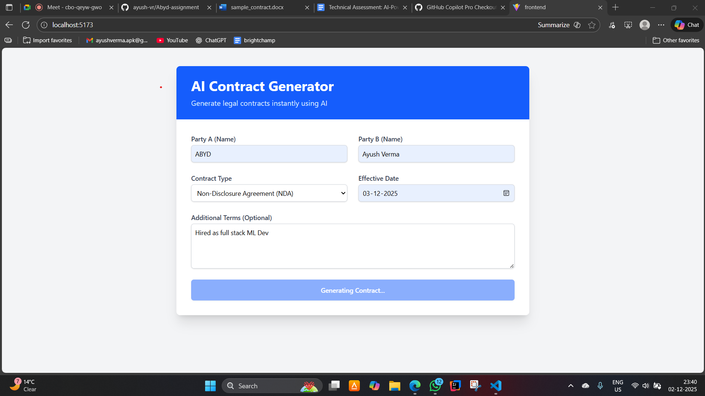
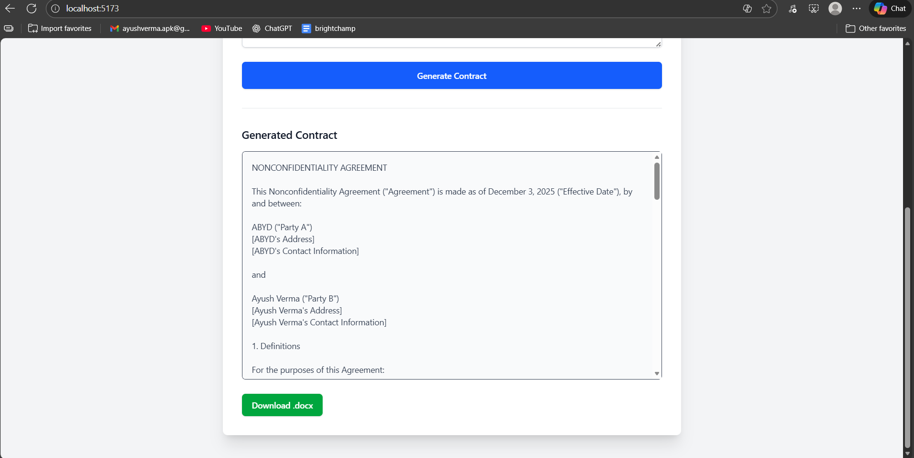
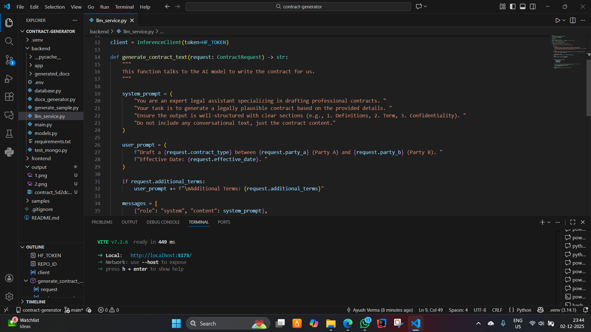

# AI Contract Generator

Welcome! This is a smart web application that helps you draft legal contracts in seconds. Think of it as a digital legal assistant that writes documents for you. You just tell it who the contract is for and what kind of contract you need, and it uses Artificial Intelligence (specifically, the Llama 3.2 model) to write a professional document for you. It even formats it into a Microsoft Word (`.docx`) file that you can download!

---

## Getting Started

Follow these simple steps to get the project running on your computer.

### 1. Prerequisites (What you need installed)

Before we start, make sure you have these free tools installed on your computer:

*   Node.js: This runs both the website (Frontend) and the server (Backend). [Download here](https://nodejs.org/).
*   Git: To download this project code. [Download here](https://git-scm.com/).

---

### 2. Setting up the "Brain" (Backend)

The backend is where the AI lives. Let's set it up first.

1.  Open your terminal (Command Prompt or PowerShell on Windows, Terminal on Mac/Linux).
2.  Go to the backend folder:
    ```bash
    cd backend
    ```
3.  Install the necessary tools:
    ```bash
    npm install
    ```
4.  Configure your secrets:
    *   Create a new file named `.env` inside the `backend` folder.
    *   Paste the following inside it (replace with your actual keys if you have them, otherwise the app has a fallback mode):
    ```env
    MONGO_URI=your_mongodb_connection_string
    HF_TOKEN=your_hugging_face_token
    ```
    *(Note: If you don't have a MongoDB database, don't worry! The app is smart enough to use a temporary memory database so you can still test it.)*

5.  Start the Backend Server:
    ```bash
    npm start
    ```
    You should see a message saying "Server running on http://localhost:8000". Keep this terminal window OPEN.

---

### 3. Setting up the "Face" (Frontend)

Now let's set up the website that you will actually interact with.

1.  Open a NEW terminal window (keep the previous one running).
2.  Go to the frontend folder:
    ```bash
    cd frontend
    ```
3.  Install the building blocks:
    ```bash
    npm install
    ```
4.  Start the Website:
    ```bash
    npm run dev
    ```
    You will see a link, usually `http://localhost:5173`.

---

### 4. How to Use It

1.  Open your web browser (Chrome, Edge, etc.).
2.  Go to http://localhost:5173.
3.  You will see a form asking for details:
    *   Party A & Party B: The names of the people or companies involved.
    *   Contract Type: Choose from the list (e.g., NDA, Employment Agreement).
    *   Effective Date: When the contract starts.
    *   Additional Terms: Any special rules you want to add (optional).
4.  Click "Generate Contract".
5.  Wait a few seconds... The AI is thinking!
6.  Once done, you can read the contract on the screen and click "Download .docx" to save it as a Word document.

---

### Output Results

Here are some screenshots of the application in action:







---

### Troubleshooting

*   "Script is disabled" error in PowerShell:
    If you see red text about scripts being disabled, run this command in PowerShell as Administrator:
    ```powershell
    Set-ExecutionPolicy RemoteSigned
    ```
*   Database Error:
    If you see an error about "Authentication failed", don't panic. The app will automatically switch to a "Mock Database" mode so you can keep working.

---

### Tech Stack (For the curious)

*   Frontend: React (built with Vite) - Fast and modern web interface.
*   Styling: Tailwind CSS - Makes it look good.
*   Backend: Node.js (Express) - Handles the requests quickly.
*   AI Model: Llama 3.2 (3B Instruct) - The brain writing the text.
*   Database: MongoDB - Stores the records (with a fallback to local memory).

Enjoy your new AI Contract Generator!
